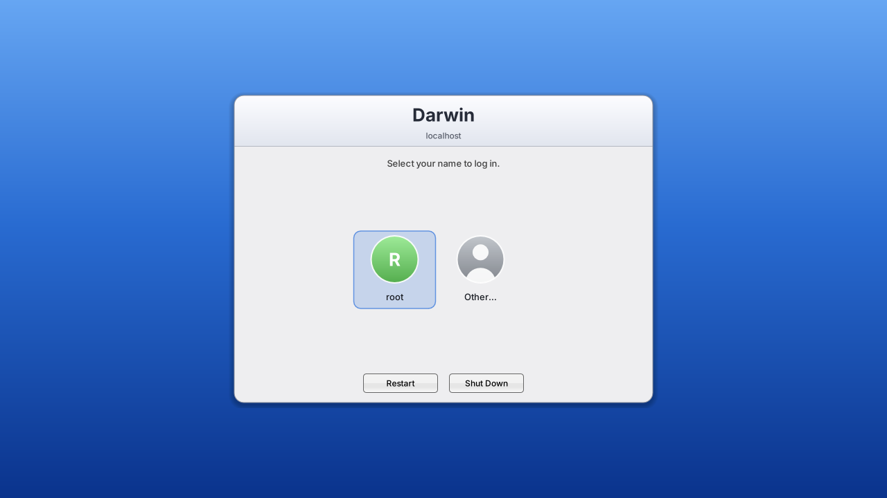
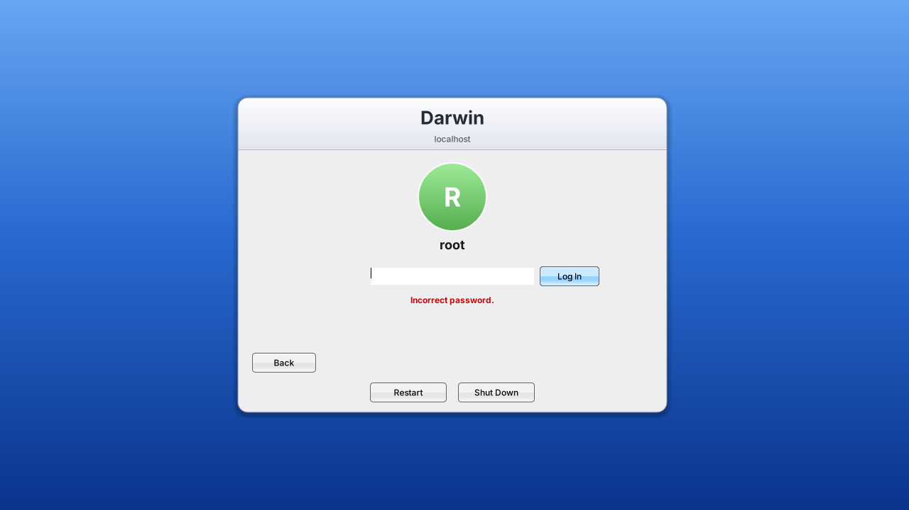

# GSDM a GNUstep Display Manager 

A display manager for GNUstep systems. It starts an X server, shows a
full-screen login window, authenticates the user and starts their X session.
It was written for a Raspberry Pi 3 running a from-source Darwin port, but
the daemon is plain C and the greeter is plain GNUstep AppKit.



A wrong password shakes the panel and shows a message:



Two programs:

| | |
|---|---|
| `daemon/` | `gsdm`, the root daemon (C; needs only libc, libXau and `crypt(3)`). |
| `LoginWindow/` | `LoginWindow.app`, the greeter (GNUstep AppKit). |
| `data/` | Example config and the `Xgreeter` / `Xsession` scripts. Not installed by `make`. |

## How it works

`gsdm` runs in the foreground (from launchd, init or a service manager) and
loops:

1. Writes a fresh MIT-MAGIC-COOKIE-1 file and starts the X server with
   `-auth`, waiting for its SIGUSR1 "ready" signal.
2. Starts the greeter (the `greeter` script) with a socketpair on fd 3.
3. Answers the greeter: `LOGIN` (checked with `crypt(3)` against the account
   database, in a short-lived child so account changes are seen at once),
   `RESTART` and `SHUTDOWN`.
4. On success, starts the session as the user (`setgid`, `setlogin`,
   `initgroups`, `setuid`, user environment, `~/.Xauthority`, `chdir HOME`,
   the `session` script), waits for it to end, removes its cookie and stops the
   X server. Then it starts again with a fresh server.

The greeter lists accounts with uid >= `min_uid` that have a real shell, plus
"Other…" for a typed name. `gsdm` repeats those checks itself. Tab and
Shift-Tab move between the fields, and a wrong password shakes the panel.

Authentication is `crypt(3)` against whatever `getpwnam()` returns as the
password hash (BSD and Darwin, or Linux via `getspnam`). There is no PAM.

## Building

gsdm uses gnustep-make. With GNUstep installed and `GNUSTEP_MAKEFILES` set
(`. /usr/GNUstep/System/Library/Makefiles/GNUstep.sh`, or your layout's
equivalent):

```
make
sudo make install
```

`gsdm` installs into `$(GNUSTEP_ADMIN_TOOLS)` and `LoginWindow.app` into
`$(GNUSTEP_LIBRARY)/CoreServices`. Override with `GSDM_INSTALL_DIR=<dir>` and
`GSDM_GREETER_INSTALL_DIR=<dir>`. The default config path is
`/etc/gsdm/gsdm.conf` (`GSDM_CONFIG_FILE=<path>`, or `gsdm -config <file>` at
run time). On glibc `libcrypt` is linked automatically; `GSDM_CRYPT_LIBS` and
`GSDM_EXTRA_OBJS` cover systems whose libc lacks `crypt`.

### Cross-building for the Pi

`build.sh` cross-builds both programs with the toolchain of the
[iokit](../iokit) checkout (Xcode 12's iPhoneOS SDK; see that repo's
`CLAUDE.md`), using this checkout rather than its pinned copy:

```
./build.sh            # build; output is in iokit's libc_build/gnustep/root
./build.sh deploy     # also copy LoginWindow.app to the Pi over ssh
```

`IOKIT_DIR` (default `../iokit`) and `DEPLOY_HOST` (default
`root@10.0.0.142`) override the paths. `deploy` needs ssh access that works
without a password prompt and does not install the daemon or restart gsdm.

## Installing

Copy `data/gsdm.conf.example` to `/etc/gsdm/gsdm.conf` and `data/Xgreeter` and
`data/Xsession` next to it, adjusting the GNUstep paths in both scripts. Run
`gsdm` as root. `SIGTERM`, `SIGINT` and `SIGHUP` stop it cleanly.

To try the greeter without a display manager, run `LoginWindow` under any X
session: without `GSDM_FD` it is in preview mode and nothing is logged in.

## Configuration

`/etc/gsdm/gsdm.conf` is `key = value`, one per line, `#` for comments.

| key | default | |
|---|---|---|
| `display` | `:0` | Display number. |
| `server` | `/usr/bin/X :0 -nolisten tcp` | X server command; `-auth <file>` is appended. |
| `server_timeout` | `120` | Seconds to wait for the server's ready signal. |
| `auth_dir` | `/var/lib/gsdm` | Where the server's cookie file goes (root-only). |
| `user_auth_dir` | `/tmp` | Fallback Xauthority dir when `~/.Xauthority` is not writable. |
| `greeter` | `/etc/gsdm/Xgreeter` | Script that starts `LoginWindow`. |
| `greeter_home` | `/var/lib/gsdm/greeter` | `HOME` for the greeter (its GNUstep defaults). |
| `session` | `/etc/gsdm/Xsession` | Script run as the user; the session ends when it exits. |
| `user_path` | `/usr/local/bin:/usr/bin:/bin` | `PATH` for users. |
| `system_path` | `/usr/local/sbin:…` | `PATH` for root and the greeter. |
| `reboot`, `halt` | `/sbin/reboot`, `/sbin/halt` | Run by Restart and Shut Down. |
| `disable_file` | none | If this file exists, gsdm exits 0 at once. |
| `require_bootarg` | none | Darwin: exit 0 unless `kern.bootargs` has `<name>=<nonzero>`. |
| `allow_root_login` | `no` | Allow uid 0. |
| `allow_null_passwd` | `no` | Allow an empty password for an account with no hash. |
| `min_uid` | `500` | Lowest uid listed in the greeter and allowed to log in. |
| `background_image` | none | Image drawn behind the panel (default: blue gradient). |
| `title` | system name | Title of the login panel; the host name is the subtitle. |

## License

MIT, see `LICENSE`.
